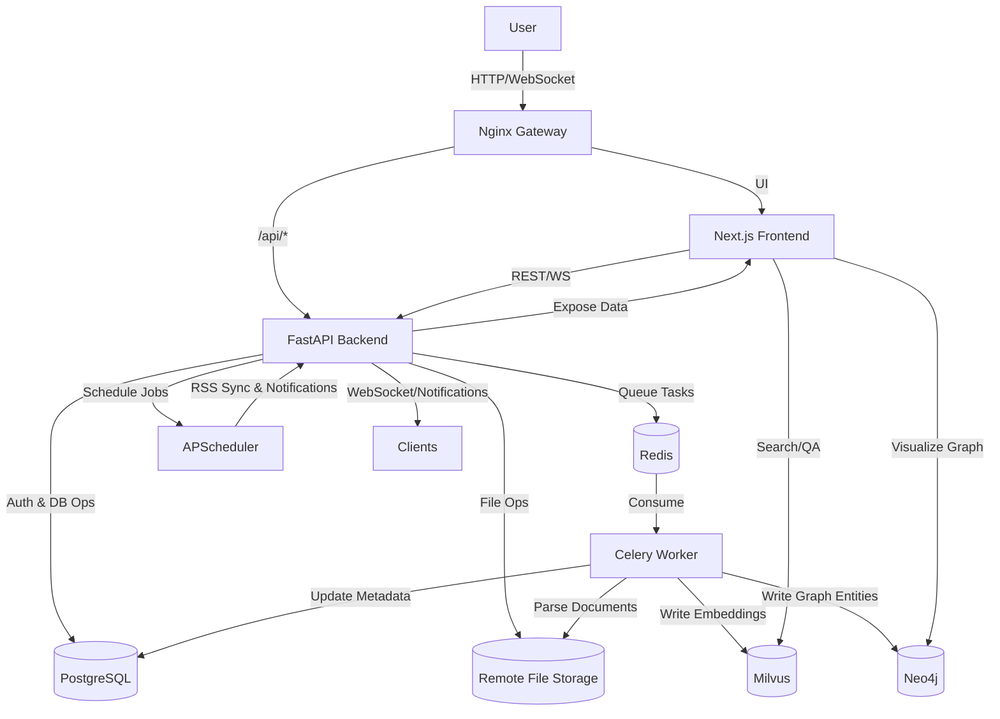

# Overall Architecture

- Docker Compose orchestrates the gateway, frontend, main backend, async worker, and data infrastructure; see the service inventory and dependencies in `docker-compose.yaml:1`.
- Nginx serves as the unified entry point, routing `/api/*` traffic to the main backend, file service, RSS service, etc.; configuration is in `nginx/nginx.conf:1`.
- The FastAPI service exposes REST and WebSocket endpoints and mounts MCP sub-apps; startup lifecycle is defined in `api/main.py:1`.
- The business flow spans "document ingestion → parsing → vectorization → knowledge graph → notification" coordinated across Celery, Milvus, Neo4j, and other components.

## Client & Gateway

- The Next.js 19 frontend hosts the entire UI, with dependencies and scripts in `web/package.json:1`; it leverages the App Router, Tailwind, and multilingual support.
- Frontend APIs read REST/WS prefixes from `.env`, mapped in `web/src/config/api.ts:1`.
- The notification WebSocket authenticates via access_token and then streams events; backend routing is in `api/router/notification.py:1`.
- Nginx proxies static assets and frontend routes to the `web` container; upstream definitions live in `nginx/nginx.conf:17`.

## Core Backend Services

- FastAPI registers user, document, AI, graph, file, and other routes in `api/main.py:1`, initializes Redis plus the scheduler, and mounts MCP HTTP endpoints.
- Business routers operate through `crud`/`models` against PostgreSQL; document-centric REST APIs reside in `api/router/document.py:1`.
- Graph queries connect directly to Neo4j, enforcing per-user isolation and returning node/edge data; see `api/router/graph.py:1`.
- MCP server management handles STD and HTTP tooling, with logic in `api/router/mcp.py:1` alongside `api/mcp_router/common.py:1` and `api/mcp_router/document.py:1`.
- Remote file system abstractions are defined in `api/protocol/remote_file_service.py:1`, supporting MinIO, OSS, S3, and more.

## Tasks & Intelligent Processing

- Celery worker setup and entrypoint live in `celery-worker/common/celery/app.py:1`, using Redis as broker/backend.
- Document parsing invokes the configured engine to generate Markdown and persist it to remote storage; core flow is in `celery-worker/common/celery/app.py:40`.
- Chunking, vectorization, and entity-relation extraction are encapsulated in `celery-worker/data/common.py:1`, supporting streaming chunking and LLM calls.
- On the FastAPI side, APScheduler handles RSS ingestion and notification triggers; initialization and cron jobs are in `api/common/apscheduler/app.py:1`.

## Data & External Dependencies

- PostgreSQL is the primary relational store; SQLAlchemy engine/session init occurs in `api/common/sql.py:1`.
- Redis provides caching and acts as the Celery broker; async connection setup is in `api/common/redis.py:1`.
- Milvus stores document embeddings; schema/index creation is in `api/data/milvus/create.py:1`, and vector writes are handled in `api/data/milvus/insert.py:1`.
- Neo4j persists entities and relations; upsert routines are in `api/data/neo4j/insert.py:1`.
- MinIO acts as the default file service, declared in Compose at `docker-compose.yaml:55` and exposed through the remote file protocol layer.
- Environment variables cover model access, OAuth, SMS, and other secrets; FastAPI loads them at startup via `api/main.py:23`.

## Supporting Services & Integrations

- The Daily Hot aggregation service runs on Hono; application entry is `daily-hot/src/app.tsx:1`, with dynamic routing setup in `daily-hot/src/registry.ts:1`.
- RSSHub and Browserless containers support RSS aggregation and web rendering; Nginx routes `/api/rss-service` to them (`nginx/nginx.conf:35`).
- Celery workers share `common`/`crud` modules and mount `./volumes/temp` for temporary processing (`docker-compose.yaml:78`).
- MCP tools expose time queries and document search through `api/mcp_router/common.py:1` and `api/mcp_router/document.py:1`, available to the built-in agent.

## Key Data Flow Example

1. When a user uploads a file or submits a URL, the FastAPI document endpoint writes metadata and schedules a transform task (`api/router/document.py:120`).
2. The Celery worker consumes the task, invokes the selected parsing engine, stores Markdown/cover via the remote file system, and updates the database (`celery-worker/common/celery/app.py:90`).
3. Markdown content proceeds through vectorization and entity extraction (`celery-worker/data/common.py:40`), then persists to Milvus/Neo4j and updates task status.
4. The frontend refreshes via React Query polling or WebSocket pushes; the notification pipeline is defined at `api/router/notification.py:38`.
