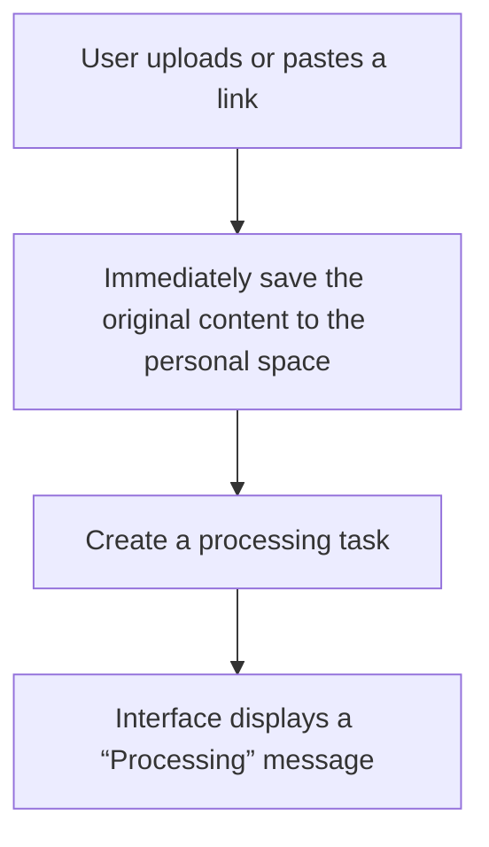
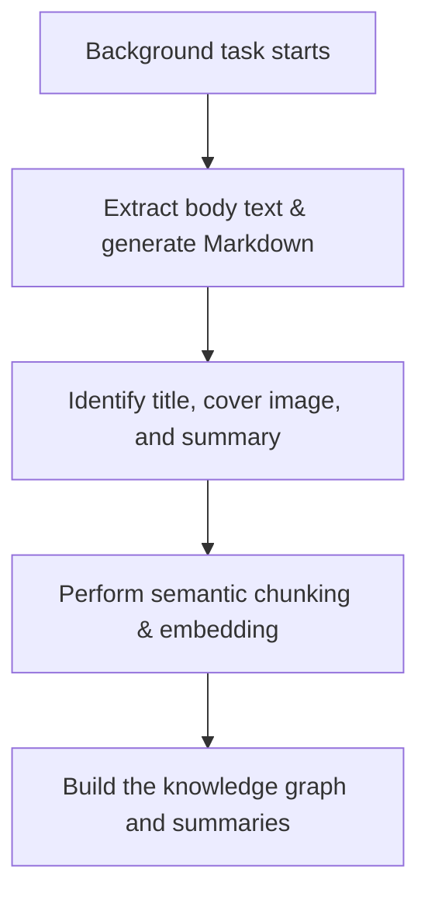
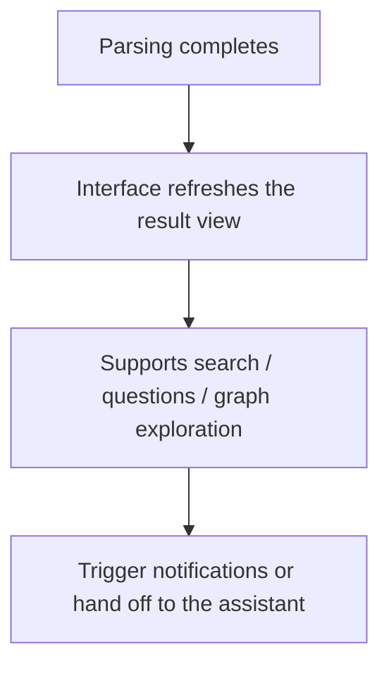

# Processing Flow

Revornix handles every document in three phases, providing real-time feedback at each step so you always know its status.

## 1. Collection

When you submit a file or a link:

The original source is securely stored to preserve traceability.

The system instantly creates a pending task, and the interface shows a “Processing” indicator to eliminate guesswork.

The document is automatically organized under the right topic or directory for easier management later.

## 2. Analysis

The background assistant starts parsing and enriching the content:

The system reads the original, extracts the main text, and produces Markdown while adding a title, cover, and description.

Semantic chunking and vectorization make the content ready for search, Q&A, and recommendations.

Knowledge graphs and summaries highlight key points, relationships, and context.

If auto-summary or section updates are enabled, related content refreshes automatically.

## 3. Notification

Results are returned and immediately ready to use:

The page updates in real time with Markdown reading, summaries, graph views, and more.

You can search, ask questions, or explore relationships, with every change shown right away.

If notifications are configured, you’ll receive an alert—whether in the notification center, email, or mobile—that the document is ready. You can also delegate follow-up tasks to the assistant.

With this flow, every post-upload step stays transparent, keeping you in control from collection to analysis to sharing.
