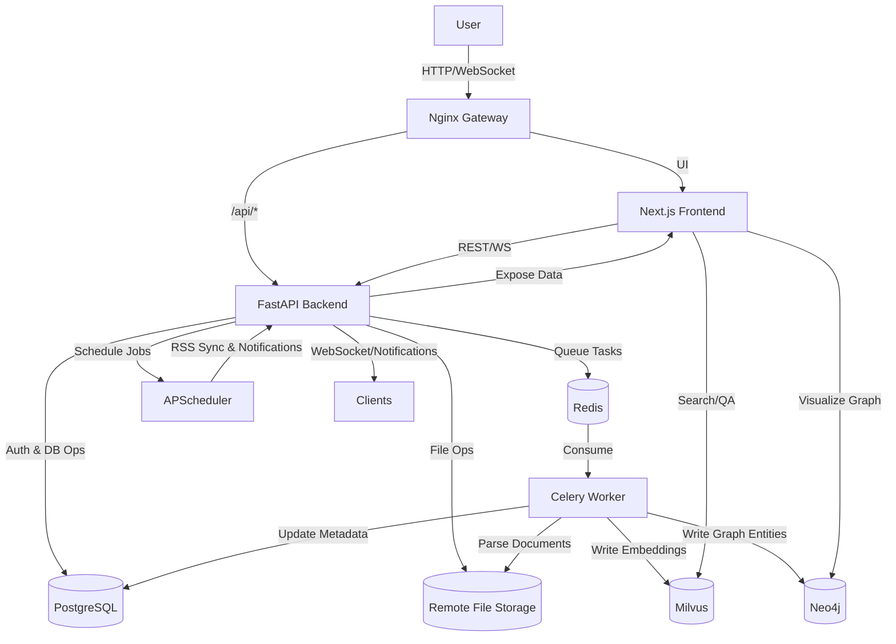

# 整体架构

- Docker Compose 统一编排网关、前端、主后端、异步 worker 及数据基础设施，服务清单和依赖参见 `docker-compose.yaml:1`
- Nginx 作为统一入口，将 `/api/*` 请求分别代理到主后端、文件服务、RSS 等微服务，配置见 `nginx/nginx.conf:1`
- FastAPI 主服务暴露 REST 与 WebSocket 接口，并挂载 MCP 子应用，初始化流程在 `api/main.py:1`
- 业务围绕“文档采集 → 解析 → 向量化 → 图谱 → 通知”的链路，借助 Celery、Milvus、Neo4j 等组件协作完成

## 客户端与网关
- Next.js 19 前端承载所有 UI，依赖与脚本声明在 `web/package.json:1`，采用 App Router、Tailwind 与多语言方案
- 前端通过 `.env` 注入的 REST/WS 前缀访问各后端常量，定义在 `web/src/config/api.ts:1`
- 通知 WebSocket 以 access_token 鉴权后推送事件，服务端路由位于 `api/router/notification.py:1`
- Nginx 将静态资源与前端路由代理至 `web` 容器，upstream 配置见 `nginx/nginx.conf:17`

## 核心后端服务
- FastAPI 在 `api/main.py:1` 中注册用户、文档、AI、图谱、文件等路由，生命周期内初始化 Redis 连接与调度器，并挂载 MCP HTTP 端点
- 各业务路由通过 `crud`/`models` 操作 PostgreSQL；文档流程的 REST 接口集中在 `api/router/document.py:1`
- 图谱查询服务直接连接 Neo4j，按用户隔离数据并返回节点/边结构，见 `api/router/graph.py:1`
- MCP Server 管理接口支持 STD 与 HTTP 两类工具，逻辑在 `api/router/mcp.py:1` 搭配 `api/mcp_router/common.py:1`、`api/mcp_router/document.py:1`
- 远程文件系统抽象封装在 `api/protocol/remote_file_service.py:1`，对接 MinIO、OSS、S3 等实现

## 任务与智能处理
- Celery Worker 配置与入口位于 `celery-worker/common/celery/app.py:1`，通过 Redis broker 分派任务
- 文档解析根据用户选择的引擎生成 Markdown 并写入远程存储，核心流程在 `celery-worker/common/celery/app.py:40`
- 文档切片、向量化与实体关系抽取封装在 `celery-worker/data/common.py:1`，支持流式 chunking 与 LLM 调用
- FastAPI 端 APScheduler 负责 RSS 同步与通知触发，初始化与定时任务注册在 `api/common/apscheduler/app.py:1`

## 数据与外部依赖
- PostgreSQL 作为主关系库，SQLAlchemy Engine/Session 初始化于 `api/common/sql.py:1`
- Redis 既做缓存又充当 Celery broker，异步连接封装见 `api/common/redis.py:1`
- Milvus 存储文档向量，集合 schema 与索引创建在 `api/data/milvus/create.py:1`，向量写入在 `api/data/milvus/insert.py:1`
- Neo4j 保存实体与关系，upsert 逻辑位于 `api/data/neo4j/insert.py:1`
- MinIO 作为默认文件服务，在 Compose 中声明（`docker-compose.yaml:55`）并通过远程文件协议暴露给业务
- 环境变量涵盖外部模型、OAuth、短信等密钥，FastAPI 启动时在 `api/main.py:23` 读取后注入依赖

## 辅助服务与集成
- Daily Hot 聚合服务基于 Hono，应用入口 `hot-news/src/app.tsx:1`，路由动态注册见 `hot-news/src/registry.ts:1`
- RSSHub 与 Browserless 容器提供 RSS/网页抓取能力，Nginx 将 `/api/rss-service` 代理至该服务（`nginx/nginx.conf:35`）
- Celery Worker 共享 `common`/`crud` 模块，并挂载卷 `./volumes/temp` 处理临时文件（`docker-compose.yaml:78`）
- MCP 工具通过 `api/mcp_router/common.py:1`、`api/mcp_router/document.py:1` 暴露时间查询与文档检索供内置 Agent 使用

## 关键数据流示例
1. 用户上传文件或提交网址时，FastAPI 文档接口写入元数据并创建转化任务，入口在 `api/router/document.py:120`
2. Celery Worker 消费任务，调用选定解析引擎与远程文件系统生成 Markdown/封面并回写数据库 `celery-worker/common/celery/app.py:90`
3. Markdown 进入向量化与实体抽取流程（`celery-worker/data/common.py:40`），再写入 Milvus/Neo4j 并更新任务状态
4. 前端通过 React Query 轮询或等待 WebSocket 推送更新，通知管道定义在 `api/router/notification.py:38`