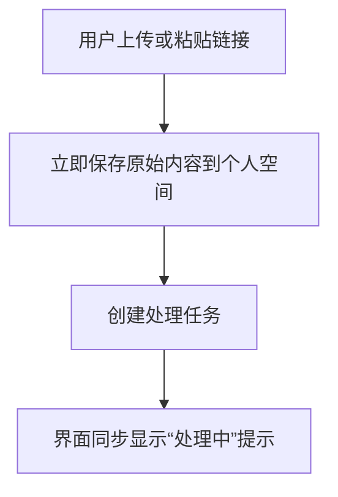
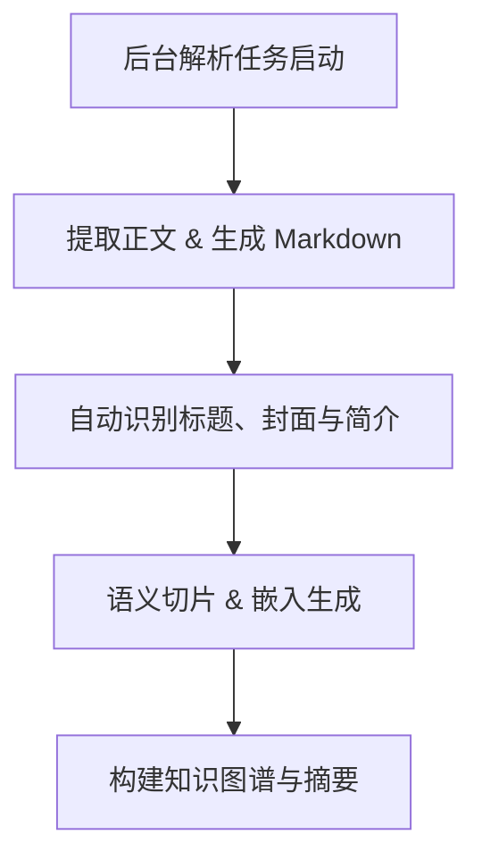
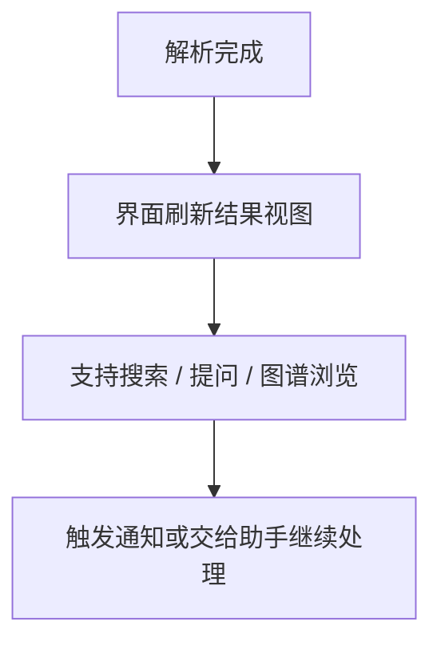

# 运行流程

Revornix 系统的处理分为三个阶段，每个阶段都保持实时状态回馈，让你清楚掌握文档进度。

## 1. 收集

当你提交文件或链接时：

原始资料被安全地保存，确保后续可追溯。

系统立刻生成待处理任务，你会在界面上看到“处理中”的反馈，避免等待焦虑。

文档会自动归入相应的主题或目录，方便后续整理。

## 2. 分析

后台助手自动启动解析与智能加工：

系统读取原件，抽取正文并生成 Markdown，同时补充标题、封面图、简介。

通过语义切片与向量化，内容可被快速检索、问答与推荐。

构建知识图谱和摘要，帮助你看到要点、关系和上下文。

若开启自动摘要或栏目更新，相关内容会同步刷新。

## 3. 通知

结果返回并随时准备被使用：

页面即时更新，包括 Markdown 阅读、摘要展示、图谱视图等。

你可以直接搜索、提问或探索关联，所有变化都会同步呈现。

如果设置了提醒，通知中心、邮箱或移动端会提示“文档已就绪”；也可以把成果交给助手执行后续任务。

这样一来，上传后的每一步都透明可见，让你始终掌握文档从收集到分析、再到分享的全流程进度。